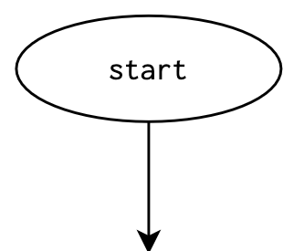
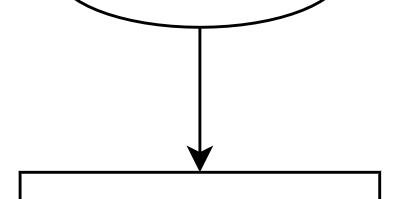
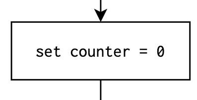
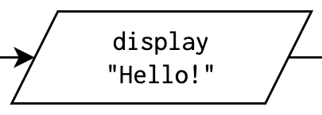
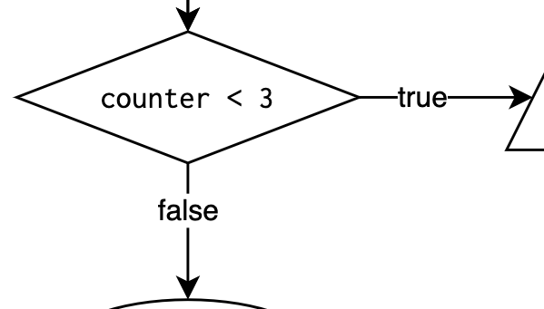
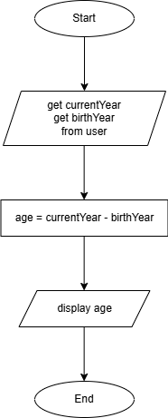
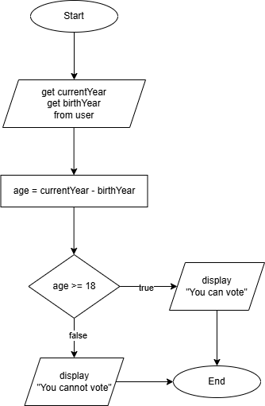
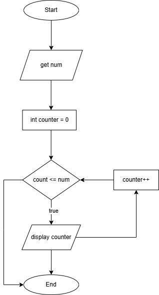
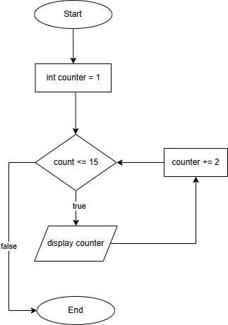

# Lesson: `For` Loops, Flow Charts & Tracing Tables

**Previous Lesson:** [For Loops](https://github.com/SACHSTech/Lesson-For-Loops)

## Algorithms
Any “interesting” computer program is complex enough that without planning, you could be stuck spinning your wheels and re-writing your code over and over again.  To avoid wasting time and making costly errors, it is important to create an algorithm -- a step-by-step procedure for solving a problem. Think of it like baking a cake, the algorithm is the recipe you must follow to bake that cake.

## What is a Flowchart?
A flowchart is a picture of an algorithm. It is a visual representation of the step-by-step order to solve a problem.  In programming, we use flowcharts to visualize the order of the instructions in a program and the various directions that are taken to solve a problem or complete its task.

### Basic Flowchart Symbols
| Symbol | Name & Description |
| ------ | ------------------ |
|  | **Start/End**<br>Used to represent the start or end of a process |
|  | **Flow Arrow**<br>Represents the direction of the process, indicating the next step. Lines should be 90 or 180 degrees. |
|  | **Processing Step**<br>Represents a basic action in the process - arithmetic calculations, initializing variables
|  | **Input/Output**<br>Used to represent both input and output |
|  | **Decision**<br>Used when a decision or choice is required that results in steps dependent on that decision. A decision is expressed as a boolean expression that results in True or False |

### Creating a Flowchart
It is beneficial to use drawing applications to create clear and concise flowcharts. You can use [draw.io](https://draw.io/) to create your diagrams.

### Example #1: (Basic input-processing-output)
A program that calculates the user's age based on their birth year and current year.

<details>
<summary><b>Flow Chart:</b></summary>

</details>

<details>
<summary><b>Code:</b></summary>
	
```java
public class AgeCalculator extends ConsoleProgram {
	public void run() {
		// Declare variables
		int currentYear;
		int birthYear;
		int age;

		// Ask user for current and birth year
		currentYear = readInt("What is the current year? ");
		birthYear = readInt("What is your birth year? ");
		
		// Calculate their age
		age = intCurrentYear - intBirthYear;

		// Tell the user their age
		System.out.println("Your age this year is " + intAge);
	}
}
```

</details>

### Example #2: (Using Decisions - If Statements)
A program that calculates the user’s age then tells the user whether they can vote or not.

<details>
<summary><b>Flow Chart:</b></summary>

</details>

<details>
<summary><b>Code:</b></summary>
	
```java
public class CanVote extends ConsoleProgram {
	public void run() {
		// Declare variables
		int currentYear;
		int birthYear;
		int age;

		// Ask user for current and birth year
		currentYear = readInt("What is the current year? ");
		birthYear = readInt("What is your birth year? ");
		
		// Calculate their age
		age = intCurrentYear - intBirthYear;

		// Determine if user can vote
		if (age >= 18) {
			System.out.println("You can vote");
		}
		else {
			System.out.println("You cannot vote");
		}
	}
}
```

</details>

### Example #3: (Count Up to n - For Loop)
A program that counts up to the number n that is inputted by the user.

<details>
<summary><b>Flow Chart:</b></summary>

</details>

<details>
<summary><b>Code:</b></summary>
	
```java
public class CountUpToN extends ConsoleProgram {
	public void run() {
		// Declare variables
		int num;

		// Get n from user
		num = readInt("Enter the number n: ");

		// Print out each number from 0 to n
		for (int counter = 0; counter <= num; counter++) {
			System.out.println(counter);
		}
	}
}
```

</details>

## Tracing Tables
Tracing tables are used to verify a solution by stepping through code and tracking the variable values and output.

A tracing table for **Example #3 **would look like this:
Let’s say the user entered 5 for `num`:
| `num` | `counter` | `counter <= num` | output |
| ----- | --------- | ---------------- | ------ |
| 5     | 0         | true             | 0      |
|       | 1         | true             | 1      |
|       | 2         | true             | 2      |
|       | 3         | true             | 3      |
|       | 4         | true             | 4      |
|       | 5         | true             | 5      |
|       | 6         | false            |        |

### Example #4: Print the Odds
Write a program that prints the odd nubmers from 1 to 15.
<details>
<summary><b>Flow Chart:</b></summary>

</details>

<details>
<summary><b>Code:</b></summary>
	
```java
public class Odds extends ConsoleProgram {
	public void run() {
		for (int counter = 1; counter <= 15; counter += 2) {
			System.out.println(counter);
		}
	}
}
```

</details>

<details>
<summary><b>Tracing Table:</b></summary>
<table>
	<tr>
		<th><code>counter</code></th>
		<th><code>counter <=15</code></th>
		<th>output</th>
	</tr>
	<tr>
		<td>1</td>
		<td>true</td>
		<td>1</td>
	</tr>
	<tr>
		<td>3</td>
		<td>true</td>
		<td>3</td>
	</tr>
	<tr>
		<td>5</td>
		<td>true</td>
		<td>5</td>
	</tr>
	<tr>
		<td>7</td>
		<td>true</td>
		<td>7</td>
	</tr>
	<tr>
		<td>9</td>
		<td>true</td>
		<td>9</td>
	</tr>
	<tr>
		<td>11</td>
		<td>true</td>
		<td>11</td>
	</tr>
	<tr>
		<td>13</td>
		<td>true</td>
		<td>13</td>
	</tr>
	<tr>
		<td>15</td>
		<td>true</td>
		<td>15</td>
	</tr>
	<tr>
		<td>17</td>
		<td>false</td>
		<td></td>
	</tr>
</table>

</details>

## Practice Problems: `For` Loops, Flow Charts & Tracing Tables

Create a **flowchart, tracing table, and the code** for each problem.

---

### Problem #1: Conversion Tables
Write a program that converts kilometers to miles from 10 to 100 km, every 10km (1km = 0.621371mi).

#### Example Runs:
```
10km --> 6.21371mi
20km --> 12.42742mi
30km --> 18.64113mi
40km --> 24.85484mi
50km --> 31.068550000000002mi
60km --> 37.28226mi
70km --> 43.49597mi
80km --> 49.70968mi
90km --> 55.92339mi
100km --> 62.137100000000004mi
```

**NOTE: Complete the flowchart and tracing tables in the Google Doc provided in Google Classroom**

---

### Problem #2: Calculating Totals
Given a number n, calculate the sum of the numbers from 1 to n.

In this problem, the sum that we are trying to calculate is known as an accumulator variable, in that we build up, or accumulate, a final value, piece by piece.  Accumulator variables are often used with a loop structure to compute totals.

**Pseudocode for using an Accumulator variable:**
```
Initialize the accumulator variable
Loop until final result is reached
	Update the value of the accumulator variable
Output accumulator
```

The key to the accumulator variable is that when we update it, we **BUILD ON TOP** of the existing value.
